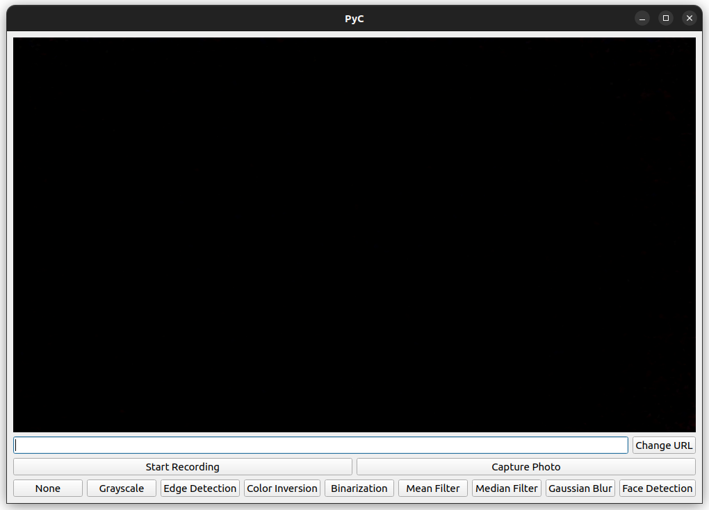

# PyC - Camera Application

PyC is a user-friendly graphical interface for managing camera functionalities and displaying real-time video feed with interactive filters.

## Installation and Requirements

To get started, ensure you have Python 3.x installed on your system. Then, install the necessary dependencies by running the following command:

```sh
pip install -r requirements.txt
```

In addition, on Linux systems, you might need to install the `libxcb-xinerama0` package:

```sh
sudo apt-get install libxcb-xinerama0
```

## Getting Started

Using the PyC application is hassle-free. Follow these steps to begin your camera adventure:

1. **Clone the Repository**: Begin by cloning the repository with the following command:
   ```sh
   git clone https://github.com/iagsoncarlos/PyC.git
   ```

2. **Navigate to the Project Directory**: Move into the freshly cloned directory using this command:
   ```sh
   cd PyC/
   ```

3. **Run the Application**: Launch the application by executing:
   ```sh
   python src/main.py
   ```

Once you've completed these steps, the application will be up and running, ready for your exploration.

## Additional Features

PyC isn't just about basic camera control. It packs these exciting features too:

2. **Change Camera Source URL**: Modify the camera source URL using the input field and the "Change URL" button.

3. **Recording and Capturing**: Seamlessly control recording sessions and snap photos with user-friendly buttons.

4. **Apply Filters**: Unleash your creativity by experimenting with various filters. Each filter adds a distinct effect to the camera feed.

## Screenshots



## Project Explanation

- `main.py`: This file holds the core application logic and sets up the user interface.
- `core/pyc.py`: This module expertly manages camera operations and the application of filters.
- `interface/gui.py`: This module is responsible for the camera interface, handling operations and filter application.
- `models/haarcascade_frontalface_default.xml`: This XML file, `haarcascade_frontalface_default.xml`, is a fundamental component for face detection. It belongs to the OpenCV library and is widely employed in face detection tasks. The file encodes critical data about facial attributes and patterns, serving the face detection algorithm.

## Documentation

For more detailed information about different aspects of the PyC project, refer to the documentation files in the `docs/` directory:

- `docs/camera.md`: This documentation provides insights into camera operations and how the camera class is implemented.

- `docs/filters.md`: Explore details about the various filters available in PyC, their purposes, and how they can be applied.

- `docs/gui.md`: Understand how the graphical user interface (GUI) of PyC is structured and how it interacts with other modules.

For further understanding of the `haarcascade_frontalface_default.xml` file and its usage, consult the [official OpenCV documentation](https://github.com/opencv/opencv/blob/master/data/haarcascades/haarcascade_frontalface_default.xml).

## License and Copyright

- This project is licensed under the MIT License.
- Copyright (c) 2023 Iágson Carlos Lima Silva

## Contact Information

If you have any questions or feedback, feel free to get in touch with me at @iagsoncarlos. Your input is valued and appreciated.